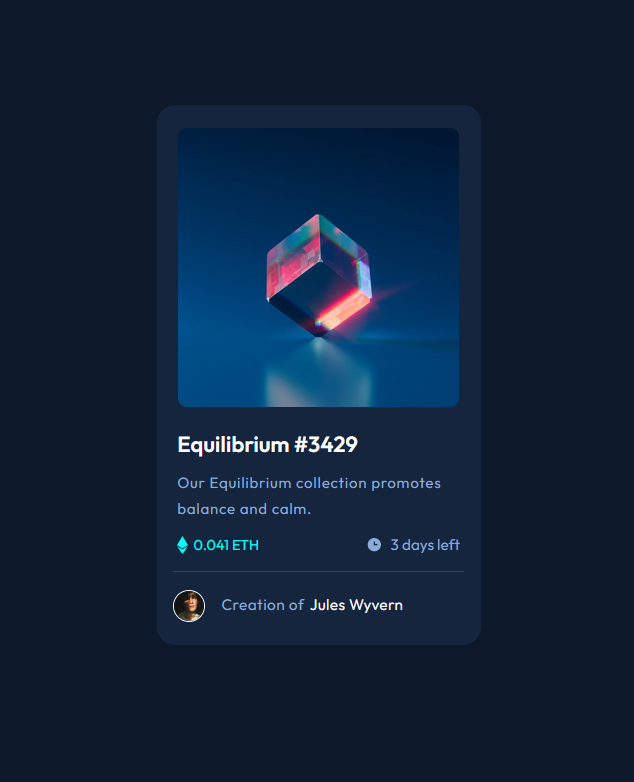

# Frontend Mentor - NFT preview card component solution

This is a solution to the [NFT preview card component challenge on Frontend Mentor](https://www.frontendmentor.io/challenges/nft-preview-card-component-SbdUL_w0U). Frontend Mentor challenges help you improve your coding skills by building realistic projects. 

## Table of contents

- [Overview](#overview)
  - [The challenge](#the-challenge)
  - [Screenshot](#screenshot)
  - [Links](#links)
- [My process](#my-process)
  - [Built with](#built-with)
  - [What I learned](#what-i-learned)
  - [Continued development](#continued-development)
  - [Useful resources](#useful-resources)
- [Author](#author)
- [Acknowledgments](#acknowledgments)

**Note: Delete this note and update the table of contents based on what sections you keep.**

## Overview

### The challenge

Users should be able to:

- View the optimal layout depending on their device's screen size
- See hover states for interactive elements

### Screenshot

### Links

- Solution URL: [Add solution URL here](https://your-solution-url.com)
- Live Site URL: [Add live site URL here](https://your-live-site-url.com)

## My process

Planned the layout on paper.

Planned the html.

Then focused on css styles starting with largest container working inwards.

### Built with

- HTML5 
- CSS 
- Flexbox

### What I learned

I used the border property to mark out the 
 containers to check sizing was correct before adding further styling. 

### Continued development

More challenges and more learning.

**Note: Delete this note and the content within this section and replace with your own plans for continued development.**

### Useful resources

- [Stackoverflow](https://stackoverflow.com) - Invaluable as always.

## Author

- Frontend Mentor - [@yiklmonkey](https://www.frontendmentor.io/profile/iklmonkey)

